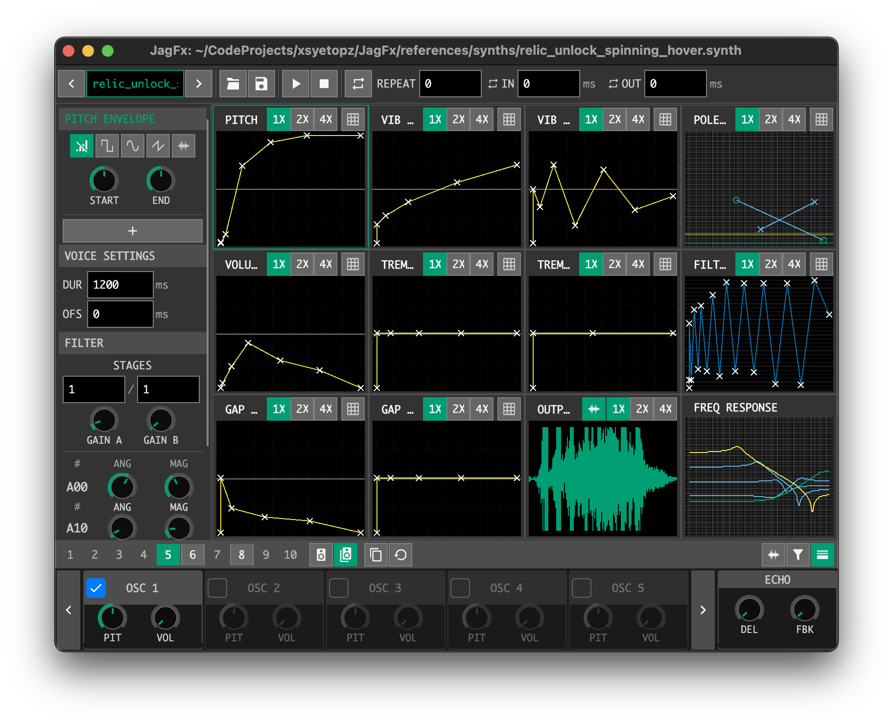

# Jagex Synth Editor

<p align="left">
  
</p>

JagFx edits Jagex Audio Synthesis (`.synth`) files, the sound-effect format used by OldSchool RuneScape. It opens, edits, visualizes, and exports OSRS synth patches.

---

## Features

| Category         | Description                                                                                                                   |
| ---------------- | ----------------------------------------------------------------------------------------------------------------------------- |
| **Signal Chain** | Per-voice signal chain with 9 envelope slots: Pitch, Volume, Vibrato Rate/Depth, Tremolo Rate/Depth, Gap Off/On, Filter       |
| **Envelopes**    | Multi-segment envelopes with configurable waveform, start/end values, and DAW-style breakpoint editing (insert, delete, drag) |
| **Partials**     | 10 additive partials per voice: volume, decicent offset, delay, and active toggle                                             |
| **Filter**       | IIR filter with pole/zero editing and live frequency-response visualization                                                   |
| **Modulation**   | FM vibrato and AM tremolo with envelope-driven rate and depth                                                                 |
| **Echo**         | Configurable echo delay and feedback level per voice                                                                          |
| **TRUE Wave**    | Live waveform preview that updates while editing                                                                              |
| **Export**       | Save as `.synth` or export to 16-bit `.wav`                                                                                   |
| **JSON**         | JSON interchange format for patch generation, inspection, and diffs                                                           |

---

## Getting Started

```bash
git clone https://github.com/xsyetopz/JagFx.git && cd JagFx
dotnet tool restore   # installs Husky.Net + CommitLint.Net git hooks
dotnet build && dotnet test
```

---

## Project Structure


```mermaid
graph TD
    subgraph src
        JagFX_Domain["JagFx.Domain<br/><sub>immutable domain model<br/>(Patch, Voice, Envelope, Filter, ...)</sub>"]
        JagFX_Core["JagFx.Core<br/><sub>shared utilities and binary buffer helpers</sub>"]
        JagFX_Io["JagFx.Io<br/><sub>.synth file reader/writer + JSON serialization</sub>"]
        JagFX_Synth["JagFx.Synthesis<br/><sub>DSP engine:<br/>renders Patch to PCM audio buffer</sub>"]
        JagFX_Desktop["JagFx.Desktop<br/><sub>Avalonia desktop GUI (MVVM)</sub>"]
        JagFX_Cli["JagFx.Cli<br/><sub>command-line converter and inspector</sub>"]
    end

    JagFX_Desktop --> JagFX_Domain
    JagFX_Desktop --> JagFX_Core
    JagFX_Desktop --> JagFX_Io
    JagFX_Desktop --> JagFX_Synth

    JagFX_Cli --> JagFX_Domain
    JagFX_Cli --> JagFX_Core
    JagFX_Cli --> JagFX_Io
    JagFX_Cli --> JagFX_Synth

    JagFX_Synth --> JagFX_Domain
    JagFX_Synth --> JagFX_Core

    JagFX_Io --> JagFX_Domain
    JagFX_Io --> JagFX_Core

    JagFX_Domain --> JagFX_Core
```

---

## Desktop GUI

```bash
dotnet run --project src/JagFx.Desktop
```

```text
┌-----------------------------------------------------┐
│  Header Bar: patch name, nav, file, transport       │
├--------------┬--------------------------------------┤
│              │                                      │
│  Inspector   │        Signal Chain Matrix           │
│  Panel       │  (voices × envelope slots)           │
│              │                                      │
├--------------┴--------------------------------------┤
│  Partials Footer: 10 additive partials per voice    │
└-----------------------------------------------------┘
```

- Header bar: patch navigation, open, save, play/stop, TRUE wave toggle, and loop controls (CNT/BGN/END).
- Signal chain matrix: rows are envelope slots (PITCH, VOLUME, V.RATE, ...), columns are voices. Each cell shows a thumbnail canvas.
- Inspector panel: controls for the selected envelope: START/END knobs, segment list, filter editor, and echo knobs.
- Partials footer: 10 additive partials with volume, decicent offset, delay, and active toggle.
- Envelope canvas: double-click to insert breakpoints, right-click for context menu, Delete key to remove points. Scroll-wheel zoom (1×/2×/4×), drag to pan when zoomed.

### Keyboard Shortcuts

| Key              | Action                                           |
| ---------------- | ------------------------------------------------ |
| `Space`          | Play / stop                                      |
| `Ctrl+O`         | Open file                                        |
| `Ctrl+S`         | Save                                             |
| `Ctrl+Shift+S`   | Save as (also supports `.wav` export)            |
| Header prev/next | Navigate to previous or next patch in directory  |
| `Up` / `Down`    | Select previous or next envelope in signal chain |
| `V`              | Toggle single-voice preview mode                 |
| `Delete`         | Remove selected envelope breakpoint              |
| `Double-click`   | Insert breakpoint / reset knob to default        |

---

## CLI

```bash
# convert .synth to .wav
dotnet run --project src/JagFx.Cli -- input.synth output.wav
dotnet run --project src/JagFx.Cli -- input.synth output.wav 4   # with loop count

# inspect
dotnet run --project src/JagFx.Cli -- inspect input.synth

# JSON round-trip
dotnet run --project src/JagFx.Cli -- to-json input.synth output.json
dotnet run --project src/JagFx.Cli -- from-json input.json output.synth
```

See `specs/synth.schema.json` for the JSON interchange schema and `specs/examples/` for example patches.

---

## Building for Distribution

| Target                             | Output                                                            |
| ---------------------------------- | ----------------------------------------------------------------- |
| `just publish-desktop-macos-arm64` | `publish/desktop/osx-arm64/JagFx.app` (single-file app bundle)    |
| `just publish-desktop-macos-x64`   | `publish/desktop/osx-x64/JagFx.app` (single-file app bundle)      |
| `just publish-desktop-windows`     | `publish/desktop/win-x64/JagFx.Desktop.exe` (single executable)   |
| `just publish-desktop-linux`       | `publish/desktop/linux-x64/JagFx.Desktop` (single executable)     |
| `just release-desktop-macos-arm64` | `publish/JagFx-<ver>-macos-arm64.dmg`                             |
| `just release-desktop-macos-x64`   | `publish/JagFx-<ver>-macos-x64.dmg`                               |
| `just release-desktop-windows`     | `publish/JagFx-<ver>-win-x64-setup.exe` (Inno Setup)              |
| `just release-desktop-linux`       | `publish/JagFx-<ver>-linux-x64.AppImage` + `.tar.gz` fallback     |
| `just release-cli`                 | Separate CLI archives for macOS arm64/x64, Windows x64, Linux x64 |
| `just release-all`                 | Desktop installers + all CLI artifacts                            |

Release version comes from `Directory.Build.props` (currently 2.2.2). The release workflow signs and notarizes macOS DMGs when the required GitHub secrets are configured.

For host-specific release steps on macOS, Windows, or Linux, see [PUBLISHING.md](PUBLISHING.md).

Framework-dependent publish, for any platform with .NET 8 installed: `dotnet publish src/JagFx.Desktop -c Release -o publish`

---

## Contributing

See [CONTRIBUTING.md](CONTRIBUTING.md) for the workflow, coding guidelines, and pull request checklist.

---

## License

[MIT](LICENSE)

---

## Acknowledgments

- [Lost City](https://github.com/LostCityRS): client-version references for `.synth` files

- [OpenOSRS](https://github.com/open-osrs/runelite/tree/master/runescape-client): decompiled client references for the `.synth` format and IIR filter
