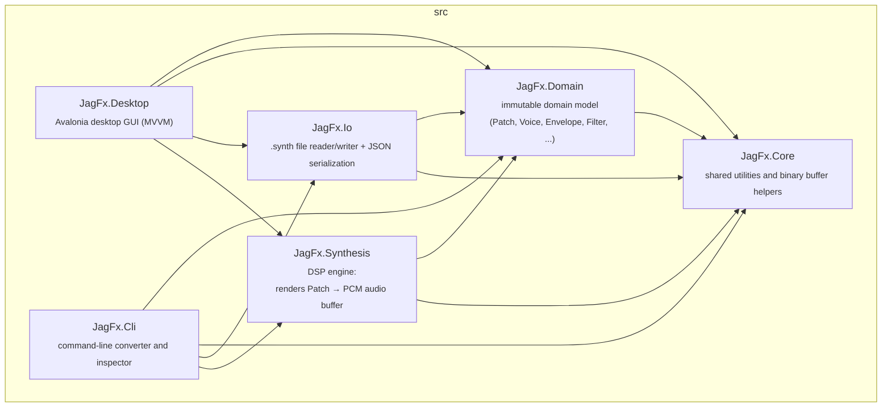

# JagFx -- Jagex Synth Editor

<p align="left">
  
</p>

Cross-platform editor for Jagex Audio Synthesis (`.synth`) files -- the sound format used by OldSchool RuneScape. Open, edit, visualize, and export OSRS sound effects.

---

## Features

| Category         | Description                                                                                                                   |
| ---------------- | ----------------------------------------------------------------------------------------------------------------------------- |
| **Signal Chain** | Per-voice signal chain with 9 envelope slots: Pitch, Volume, Vibrato Rate/Depth, Tremolo Rate/Depth, Gap Off/On, Filter       |
| **Envelopes**    | Multi-segment envelopes with configurable waveform, start/end values, and DAW-style breakpoint editing (insert, delete, drag) |
| **Partials**     | 10 additive partials per voice -- volume, decicent offset, delay, and active toggle                                           |
| **Filter**       | IIR filter with interactive pole/zero editor and real-time frequency response visualization                                   |
| **Modulation**   | FM vibrato and AM tremolo with envelope-driven rate and depth                                                                 |
| **Echo**         | Configurable echo delay and feedback level per voice                                                                          |
| **TRUE Wave**    | Live waveform preview that re-renders within ~100 ms of any edit                                                              |
| **Export**       | Save as `.synth` or export to 16-bit `.wav`                                                                                   |
| **JSON**         | Human-readable JSON interchange format for programmatic patch creation and inspection                                         |

---

## Getting Started

```bash
git clone https://github.com/xsyetopz/JagFx.git && cd JagFx
dotnet build && dotnet test
```

---

## Project Structure


```mermaid
graph TD
    subgraph src
        JagFX_Domain["JagFx.Domain<br/><sub>immutable domain model<br/>(Patch, Voice, Envelope, Filter, ...)</sub>"]
        JagFX_Core["JagFx.Core<br/><sub>shared utilities and binary buffer helpers</sub>"]
        JagFX_Io["JagFx.Io<br/><sub>.synth file reader/writer + JSON serialization</sub>"]
        JagFX_Synth["JagFx.Synthesis<br/><sub>DSP engine:<br/>renders Patch → PCM audio buffer</sub>"]
        JagFX_Desktop["JagFx.Desktop<br/><sub>Avalonia desktop GUI (MVVM)</sub>"]
        JagFX_Cli["JagFx.Cli<br/><sub>command-line converter and inspector</sub>"]
    end

    JagFX_Desktop --> JagFX_Domain
    JagFX_Desktop --> JagFX_Core
    JagFX_Desktop --> JagFX_Io
    JagFX_Desktop --> JagFX_Synth

    JagFX_Cli --> JagFX_Domain
    JagFX_Cli --> JagFX_Core
    JagFX_Cli --> JagFX_Io
    JagFX_Cli --> JagFX_Synth

    JagFX_Synth --> JagFX_Domain
    JagFX_Synth --> JagFX_Core

    JagFX_Io --> JagFX_Domain
    JagFX_Io --> JagFX_Core

    JagFX_Domain --> JagFX_Core
```

---

## Desktop GUI

```bash
dotnet run --project src/JagFx.Desktop
```

```text
┌-----------------------------------------------------┐
│  Header Bar  -- patch name, nav, file, transport    │
├--------------┬--------------------------------------┤
│              │                                      │
│  Inspector   │        Signal Chain Matrix           │
│  Panel       │  (voices × envelope slots)           │
│              │                                      │
├--------------┴--------------------------------------┤
│  Partials Footer -- 10 additive partials per voice  │
└-----------------------------------------------------┘
```

- **Header bar** -- patch navigation (◀/▶), open, save, play/stop, TRUE wave toggle, loop controls (CNT/BGN/END).
- **Signal chain matrix** -- rows are envelope slots (PITCH, VOLUME, V.RATE, ...), columns are voices. Each cell shows a thumbnail canvas and a MODE dropdown.
- **Inspector panel** -- editing controls for the selected envelope: START/END knobs, segment list, filter editor, echo knobs.
- **Partials footer** -- 10 additive partials with volume, decicent offset, delay, and active toggle.
- **Envelope canvas** -- double-click to insert breakpoints, right-click for context menu, Delete key to remove points. Scroll-wheel zoom (1×/2×/4×), drag to pan when zoomed.

### Keyboard Shortcuts

| Key            | Action                                          |
| -------------- | ----------------------------------------------- |
| `Space`        | Play / stop                                     |
| `Ctrl+O`       | Open file                                       |
| `Ctrl+S`       | Save                                            |
| `Ctrl+Shift+S` | Save as (also supports `.wav` export)           |
| `◀ ▶` (header) | Navigate to previous / next patch in directory  |
| `↑ / ↓`        | Select previous / next envelope in signal chain |
| `V`            | Toggle single-voice preview mode                |
| `Delete`       | Remove selected envelope breakpoint             |
| `Double-click` | Insert breakpoint / reset knob to default       |

---

## CLI

```bash
# convert .synth to .wav
dotnet run --project src/JagFx.Cli -- input.synth output.wav
dotnet run --project src/JagFx.Cli -- input.synth output.wav 4   # with loop count

# inspect
dotnet run --project src/JagFx.Cli -- inspect input.synth

# JSON round-trip
dotnet run --project src/JagFx.Cli -- to-json input.synth output.json
dotnet run --project src/JagFx.Cli -- from-json input.json output.synth
```

See `specs/synth.schema.json` for the JSON interchange schema and `specs/examples/` for example patches.

---

## Building for Distribution

| Target                     | Output                                                    |
| -------------------------- | --------------------------------------------------------- |
| `make publish-macos-arm64` | `publish/osx-arm64/JagFx.app` -- unsigned (Apple Silicon) |
| `make publish-macos-x64`   | `publish/osx-x64/JagFx.app` -- unsigned (Intel)           |
| `make publish-windows`     | `publish/win-x64/JagFx.Desktop.exe` -- single executable  |
| `make publish-linux`       | `publish/linux-x64/JagFx.Desktop` -- single executable    |
| `make release-macos`       | Signed, notarized `.tar.gz` archives (both arches)        |
| `make release-linux`       | `.tar.gz` archive                                         |
| `make release-windows`     | `.zip` archive                                            |
| `make release-all`         | All platforms                                             |

Release archives use the version from `Directory.Build.props` (currently 2.2.0). macOS signing requires `.env` with notarization credentials.

Framework-dependent (any platform with .NET 8): `dotnet publish src/JagFx.Desktop -c Release -o publish`

---

## Contributing

Contributions are welcome. See [CONTRIBUTING.md](CONTRIBUTING.md) for the workflow, coding guidelines, and pull request checklist.

---

## License

MIT -- see [LICENSE](LICENSE) for details.

---

## Acknowledgments

[Lost City](https://github.com/LostCityRS) -- different client versions of `.synth` files

[OpenOSRS](https://github.com/open-osrs/runelite/tree/master/runescape-client) -- decompiled and partially deobfuscated files related to the `.synth` format and IIR filter
