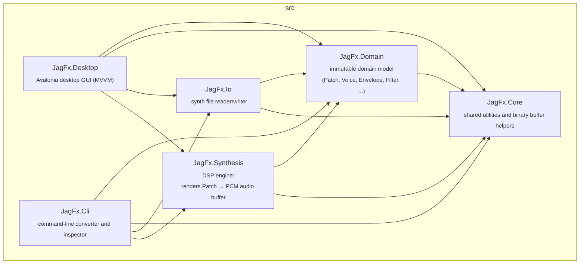

# JagFx -- Jagex Synth Editor

<p align="left">
  
</p>

Cross-platform editor for Jagex Audio Synthesis (`.synth`) files -- the sound format used by OldSchool RuneScape. Open, edit, visualize, and export OSRS sound effects.

---

## Contents

- [Features](#features)
- [Project Structure](#project-structure)
- [Requirements](#requirements)
- [Getting Started](#getting-started)
- [Desktop GUI](#desktop-gui)
- [CLI](#cli)
- [Building for Distribution](#building-for-distribution)
- [Examples](#examples)
- [Contributing](#contributing)
- [License](#license)
- [Acknowledgments](#acknowledgments)

---

## Features

| Category | Description |
|----------|-------------|
| **Signal Chain** | Per-voice signal chain with 9 envelope slots: Pitch, Volume, Vibrato Rate/Depth, Tremolo Rate/Depth, Gap Off/On, Filter |
| **Envelopes** | Multi-segment envelopes with configurable waveform (Off, Square, Sine, Saw, Noise), start/end values, and draggable breakpoints |
| **Partials** | 10 additive partials per voice -- volume, decicent offset, and time delay |
| **Filter** | IIR filter with interactive pole/zero editor and real-time frequency response visualization |
| **Modulation** | FM vibrato and AM tremolo with envelope-driven rate and depth |
| **Echo** | Configurable echo delay and feedback level per voice |
| **TRUE Wave** | Live waveform preview that re-renders within ~100 ms of any edit |
| **Export** | Save as `.synth` or export to 16-bit `.wav` |

---

## Project Structure


```mermaid
graph TD
    subgraph src
        JagFX_Domain["JagFx.Domain<br/><sub>immutable domain model<br/>(Patch, Voice, Envelope, Filter, ...)</sub>"]
        JagFX_Core["JagFx.Core<br/><sub>shared utilities and binary buffer helpers</sub>"]
        JagFX_Io["JagFx.Io<br/><sub>.synth file reader/writer</sub>"]
        JagFX_Synth["JagFx.Synthesis<br/><sub>DSP engine:<br/>renders Patch → PCM audio buffer</sub>"]
        JagFX_Desktop["JagFx.Desktop<br/><sub>Avalonia desktop GUI (MVVM)</sub>"]
        JagFX_Cli["JagFx.Cli<br/><sub>command-line converter and inspector</sub>"]
    end

    JagFX_Desktop --> JagFX_Domain
    JagFX_Desktop --> JagFX_Core
    JagFX_Desktop --> JagFX_Io
    JagFX_Desktop --> JagFX_Synth

    JagFX_Cli --> JagFX_Domain
    JagFX_Cli --> JagFX_Core
    JagFX_Cli --> JagFX_Io
    JagFX_Cli --> JagFX_Synth

    JagFX_Synth --> JagFX_Domain
    JagFX_Synth --> JagFX_Core

    JagFX_Io --> JagFX_Domain
    JagFX_Io --> JagFX_Core

    JagFX_Domain --> JagFX_Core
```
<!--
- JagFx.Domain depends on JagFx.Core
- JagFx.Io depends on JagFx.Domain & JagFx.Core
- JagFx.Synthesis depends on JagFx.Domain & JagFx.Core
- JagFx.Desktop and JagFx.Cli both depend on JagFx.Domain, JagFx.Core, JagFx.Io, and JagFx.Synthesis
-->

---

## Requirements

- [.NET 8.0 SDK](https://dotnet.microsoft.com/download) or later

---

## Getting Started

```bash
git clone https://github.com/xsyetopz/JagFx.git
cd JagFx

dotnet build       # build all projects
dotnet test        # run tests
```

---

## Desktop GUI

```bash
dotnet run --project src/JagFx.Desktop
```

### Layout

```text
┌─────────────────────────────────────────────────────┐
│  Header Bar  -- patch name, nav, file, transport    │
├──────────────┬──────────────────────────────────────┤
│              │                                      │
│  Inspector   │        Signal Chain Matrix           │
│  Panel       │  (voices × envelope slots)           │
│              │                                      │
├──────────────┴──────────────────────────────────────┤
│  Partials Footer -- 10 additive partials per voice  │
└─────────────────────────────────────────────────────┘
```

- **Header bar** -- patch navigation (◀/▶), open, save, play/stop, TRUE wave toggle.
- **Signal chain matrix** -- rows are envelope slots (PITCH, VOLUME, V.RATE, ...), columns are voices (1–6). Each cell shows a thumbnail canvas and a MODE dropdown for waveform selection.
- **Inspector panel** -- editing controls for the selected envelope: START/END knobs, segment list (DUR/LVL per segment), filter editor, echo knobs.
- **Partials footer** -- 10 additive partials for the selected voice with volume, decicent offset, and delay.

### Workflow

1. Open a `.synth` file (`Ctrl+O` or drag-and-drop).
2. Select a voice column (1–6); inactive voices are dimmed, active ones are at full brightness, selected has an accent border.
3. Click a signal chain cell (PITCH, VOLUME, ...) to open it in the inspector.
4. Use the **MODE** dropdown on a cell to set the envelope waveform (Off / Square / Sine / Saw / Noise).
5. Drag breakpoints on the envelope canvas or adjust START/END/DUR/LVL with the knobs.
6. Enable **TRUE** in the header -- the waveform canvas updates live as you edit.
7. `Space` to preview playback, `Ctrl+S` to save, `Ctrl+Shift+S` to save as / export WAV.

### Keyboard Shortcuts

| Key | Action |
|-----|--------|
| `Space` | Play / stop |
| `Ctrl+O` | Open file |
| `Ctrl+S` | Save |
| `Ctrl+Shift+S` | Save as (also supports `.wav` export) |
| `◀ ▶` (header) | Navigate to previous / next patch in directory |
| `↑ / ↓` | Select previous / next envelope in signal chain |
| `V` | Toggle single-voice preview mode |

---

## CLI

### Convert `.synth` to `.wav`

```bash
# positional arguments
dotnet run --project src/JagFx.Cli --framework net8.0 -- input.synth output.wav

# with loop count
dotnet run --project src/JagFx.Cli --framework net8.0 -- input.synth output.wav 4

# named flags
dotnet run --project src/JagFx.Cli --framework net8.0 -- -i input.synth -o output.wav
dotnet run --project src/JagFx.Cli --framework net8.0 -- -i input.synth -o output.wav -l 4
```

### Inspect a `.synth` file

```bash
dotnet run --project src/JagFx.Cli --framework net8.0 -- inspect input.synth
```

---

## Building for Distribution

### Self-Contained Executable

```bash
# Windows (x64)
dotnet publish -c Release -r win-x64 --self-contained -o publish/win-x64

# Linux (x64)
dotnet publish -c Release -r linux-x64 --self-contained -o publish/linux-x64

# macOS (Intel)
dotnet publish -c Release -r osx-x64 --self-contained -o publish/osx-x64

# macOS (Apple Silicon)
dotnet publish -c Release -r osx-arm64 --self-contained -o publish/osx-arm64
```

### Framework-Dependent

```bash
dotnet publish -c Release -o publish
```

---

## Contributing

Contributions are welcome. See [CONTRIBUTING.md](CONTRIBUTING.md) for the workflow, coding guidelines, and pull request checklist.

---

## License

MIT -- see [LICENSE](LICENSE) for details.

---

## Acknowledgments

[Lost City](https://github.com/LostCityRS) -- different client versions of `.synth` files

[OpenOSRS](https://github.com/open-osrs/runelite/tree/master/runescape-client) -- decompiled and partially deobfuscated files related to the `.synth` format and IIR filter
